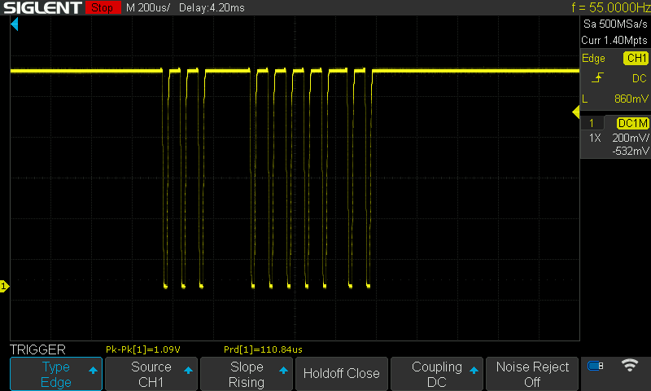
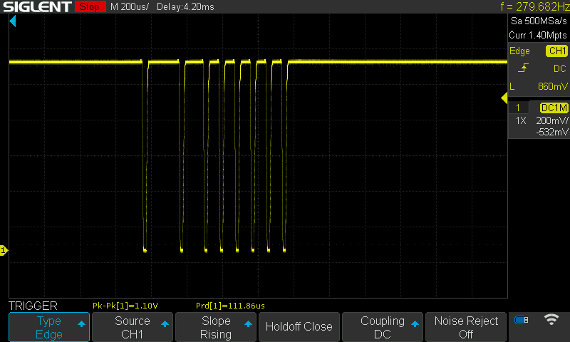
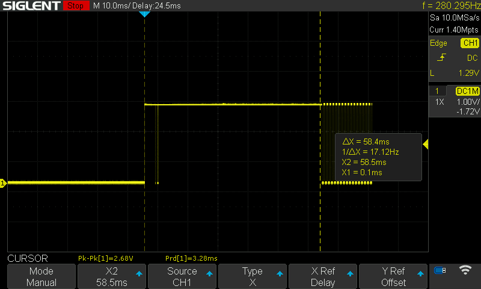
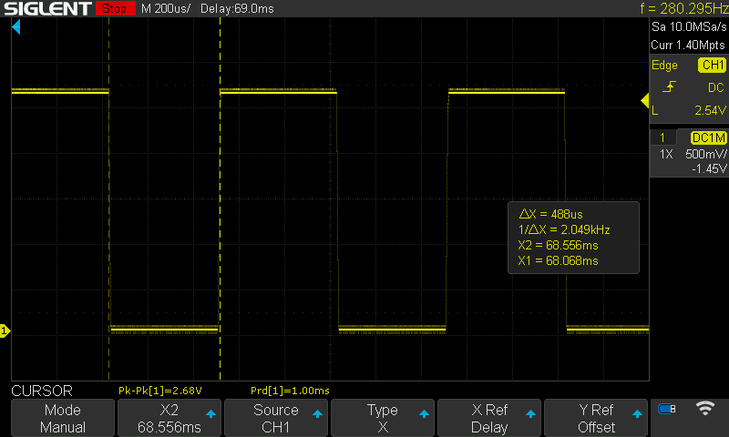

# smart-domofon

ESP32/8266/12E implementation of Unifon digital domfon/intercom

### Is this project finished?
NO

### When this project will be finished?
> Witam, chyba nigdy  

I think never. It is hobby project :) 

## Documentation
I'll share my learnings here.

### General
* L+ is analog, 0-11V
* L- is GND
* digital domofon - it is only the name. It is still analog in practice.

### IDLE
In IDLE mode, L+ is 0 state

### Dialling

In dialling mode L+ starting be UP.
And then we have 58ms to count all Edge falling. 
Count of edge falling is dialled number.

Example how it looks like when number 10 is called

Example how it looks like when number 8 is called

Here full view of dialling procedure. It takes 58ms

### Calling
After 58ms of dialling, the calling procedure is started.

It changes the state in 0.5s interval

