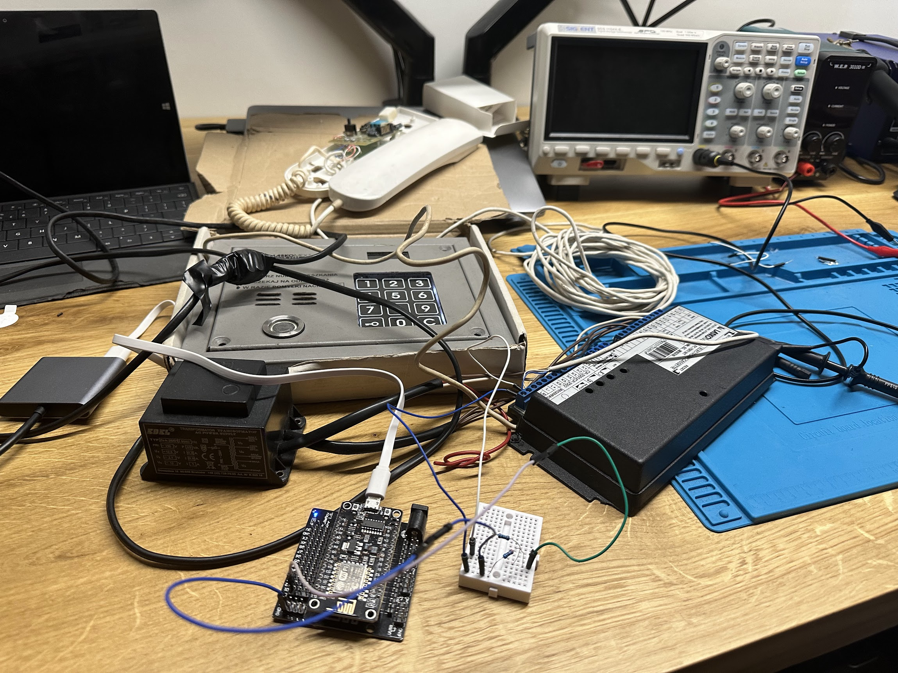

# smart-domofon

ESP32/8266/12E implementation of Unifon digital domfon/intercom

## Is this project finished?
NO

## When this project will be finished?
> Witam, chyba nigdy  

I think never. It is hobby project :) 

# Documentation
I'll share my learnings here.

## General
* L+ is analog, 0-11V
* L- is GND
* digital domofon - it is only the name. It is still analog in practice.

## How to connect into ESP?
ESP works only on 3.3v. Intercom is working on 11v. Some resistors is needed.
My setup:

## IDLE
In IDLE mode, L+ is 0 state

## Dialling

In dialling mode L+ starting be UP.
And then we have 58ms to count all Edge falling. 
Count of edge falling is dialled number.

#### Example how it looks like when number 10 is called

#### Example how it looks like when number 8 is called

#### Here full view of dialling procedure. It takes 58ms

## Detecting signal type
After 58ms of dialling, the event type need to be detected.

* ringing: 500uS interval
* wrong gate pin: 280uS interval, 530uS cycle
* correct gate pin: 218uS interval , 424uS cycle

Solution implemented: 
Wait after dialling for next pull-up, start counting pull-ups for 10ms.
* 10 ±1 = calling
* 5 ±1 = wrong gate ping
* 23 ±1 - correct pin

#### Example of calling - interval 500uS, 1ms cycle
 

#### Example of gate unlock - interval 220uS, 424uS cycle
 

#### Example of gate unlock wrong pin - interval 280uS, cycle around 530uS

 

